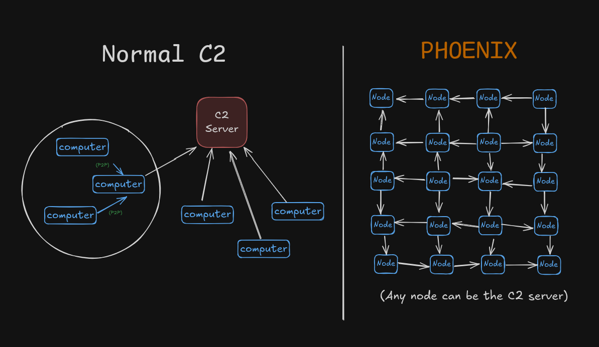

**Traditional Command & Control (C2)** works exactly like a classic army: one central server (or domain) sits at the top, and every compromised machine (agent) phones home to it on a regular schedule to receive orders. This design is simple and fast, but it has a fatal weakness – it’s a single point of failure. As soon as defenders discover and block that one IP, domain, or server, the entire operation collapses instantly. Thousands of agents become blind and useless the moment their command center disappears.  
PHOENIX throws that model away:

**No server. No domain. No single point of failure.** You can't kill what has no head.

## Why PHOENIX is a Game Changer

| Feature                        | Traditional C2 | PHOENIX                              |
|--------------------------------|----------------|--------------------------------------|
| Central server?                | Yes            | Never                                |
| Killable by blocking 1 IP?     | Yes            | Impossible                           |
| Operator has fixed location?   | Yes            | No – any node with the secret key    |
| Network dies when nodes drop?  | Yes            | No – self-healing graph              |
| Detectable by traffic pattern? | Easy           | Extremely hard (only 5 neighbors)    |
| Command authenticity           | Server cert    | Ed25519-signed by secret key         |

## Core Features

- Fully decentralized P2P graph
- Max 5 neighbors per agent → tiny traffic footprint
- Automatic self-healing
- Operator = whoever has the secret key
- Commands signed with Ed25519 → no spoofing
- End-to-end encrypted
- GossipSub broadcast (fast & reliable)
- Single binary, zero dependencies – works on Windows, Linux, macOS, ARM
- NAT traversal & hole punching built-in

## 🚧 Current Engineering Challenges & Limitations

While **PHOENIX** achieves exceptional resilience by eliminating the traditional Single Point of Failure (SPoF), fully distributed systems come with their own dragons to tame. These are the major engineering fronts still under active development.

| Area | Summary of Problem | Current Status | Planned Improvement |
|------|--------------------|----------------|----------------------|
| 🌐 NAT Traversal & Egress | Corporate NAT/Firewalls block P2P connections; hole punching fails on Symmetric NATs. | Requires manual Bootstrap/Relay nodes. | Add STUN/TURN/DoH to improve NAT traversal and reduce relay dependency. |
| ⚡ Latency & Scalability | GossipSub slows down in large meshes (5–10s delays at 1000+ nodes). | Stable performance (~2–5s) under 500 nodes. | Add epidemic routing or priority-based gossip for <2s delivery. |
| 🔑 Key Management | Static Ed25519 key; no rotation or revocation if compromised. | Fixed keypair, loss means full loss of control. | Implement JWT-like tokens or rotating CA for secure revocation. |
| 🕵️ Traffic Evasion | Raw libp2p traffic detected by NIDS; suspicious high-port encrypted patterns. | Using default Noise protocol transport. | Wrap traffic in WebSockets, DNS, ICMP, or other pluggable transports. |
